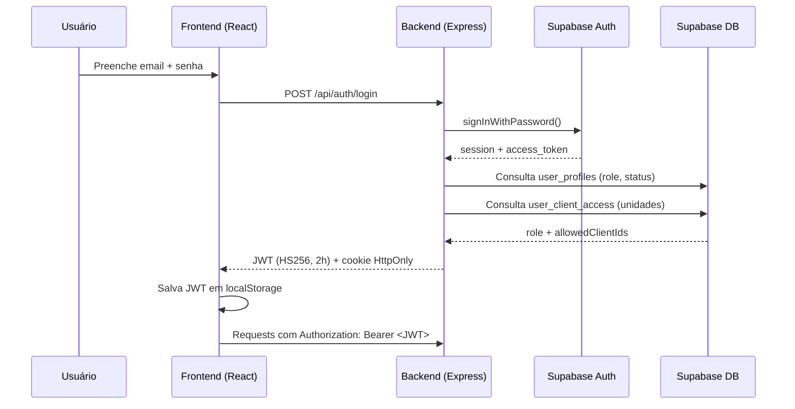
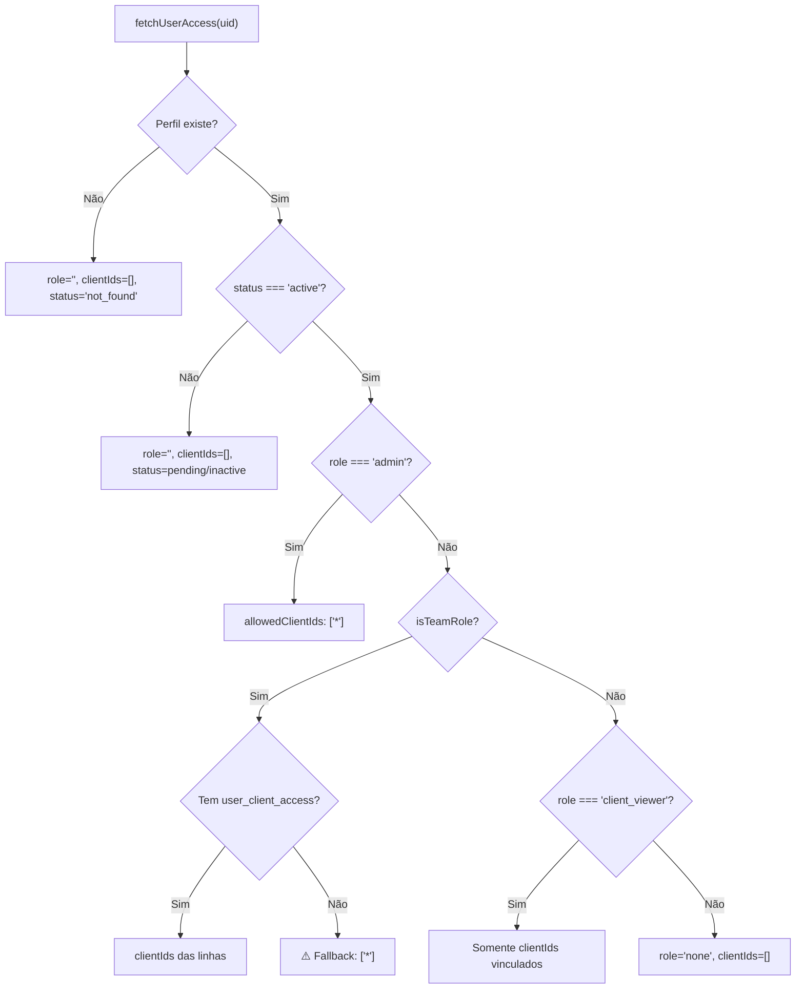
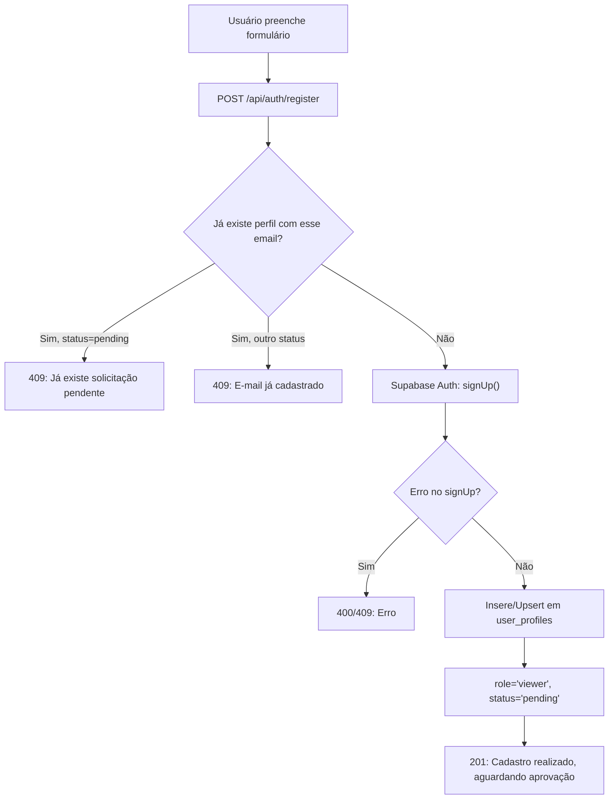
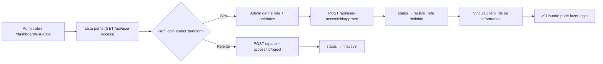
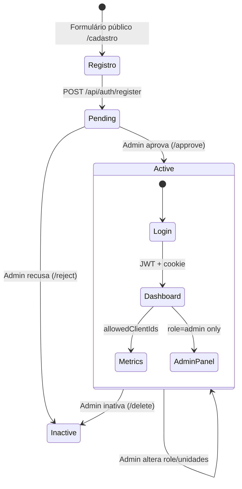

# 🔐 Auditoria Completa — Login, Registro e Controle de Acessos

**Plataforma:** Tráfego Pro  
**Data:** 01/09/2026  
**Escopo:** Backend (Express + Supabase) e Frontend (React + Wouter)

---

## 1. Arquitetura Geral de Autenticação

### Stack de Autenticação

| Componente | Tecnologia | Arquivo |
|---|---|---|
| Autenticação primária | Supabase Auth (email/password) | [supabase.ts](file:///c:/Users/Davi%20Menegazzi/Desktop/Projetos%20Dev/Website%20Tr%C3%A1fego%20Pro/server/supabase.ts) |
| Token da aplicação | JWT HS256 (2h expiry) | [auth.ts](file:///c:/Users/Davi%20Menegazzi/Desktop/Projetos%20Dev/Website%20Tr%C3%A1fego%20Pro/server/auth.ts) |
| Sessão Supabase | Cookie HttpOnly `tp_supabase_access` (50min) | [auth.ts L182-183](file:///c:/Users/Davi%20Menegazzi/Desktop/Projetos%20Dev/Website%20Tr%C3%A1fego%20Pro/server/auth.ts#L182-L183) |
| Persistência no client | `localStorage` (`tp_token`, `tp_user`) | [useAdminAuth.ts](file:///c:/Users/Davi%20Menegazzi/Desktop/Projetos%20Dev/Website%20Tr%C3%A1fego%20Pro/client/src/hooks/useAdminAuth.ts) |

---

## 2. Sistema de Roles e Permissões

### Roles Disponíveis

| Role | Tipo | Acesso Padrão |
|---|---|---|
| `admin` | Administrador | Acesso total (`allowedClientIds: ["*"]`) |
| `viewer` | Equipe | Unidades vinculadas ou todas se sem vínculo |
| `designer` | Equipe | Unidades vinculadas ou todas se sem vínculo |
| `cs` | Equipe (Customer Success) | Unidades vinculadas ou todas se sem vínculo |
| `account_manager` | Equipe | Unidades vinculadas ou todas se sem vínculo |
| `traffic_manager` | Equipe | Unidades vinculadas ou todas se sem vínculo |
| `copywriter` | Equipe | Unidades vinculadas ou todas se sem vínculo |
| `client_viewer` | Cliente externo | **Somente** unidades vinculadas (sem fallback) |
| `none` / desconhecida | — | Sem acesso algum |

> [!IMPORTANT]
> **Fallback perigoso para team roles:** Se um usuário de equipe (`viewer`, `designer`, etc.) **não tiver nenhum registro** em `user_client_access`, o sistema concede `allowedClientIds: ["*"]` (acesso total). Isso está em [auth.ts L124](file:///c:/Users/Davi%20Menegazzi/Desktop/Projetos%20Dev/Website%20Tr%C3%A1fego%20Pro/server/auth.ts#L124).

### Tabelas Supabase Envolvidas

| Tabela | Finalidade |
|---|---|
| `user_profiles` | Perfil do usuário (id, email, full_name, role, status, bio, avatar_url) |
| `user_client_access` | Vínculo usuário ↔ unidade (user_id, client_id, granted_by) |
| `clients` | Cadastro de unidades/franquias (id, name, client_group) |

### Hierarquia de Verificação de Acesso

---

## 3. Fluxo de Login

### Endpoint: `POST /api/auth/login`
**Arquivo:** [authRoutes.ts L157-241](file:///c:/Users/Davi%20Menegazzi/Desktop/Projetos%20Dev/Website%20Tr%C3%A1fego%20Pro/server/routes/authRoutes.ts#L157-L241)

**Rate Limit:** 20 tentativas / 15 minutos

#### Passo a passo:

1. **Validação de input:** email e senha obrigatórios
2. **Autenticação Supabase:** `signInWithPassword({ email, password })`
3. **Verificação de perfil:** Consulta `user_profiles` pelo UID retornado
4. **Verificação de status:**
   - `pending` → 403 ("aguardando aprovação")
   - `inactive` / `rejected` → 403 ("acesso inativo ou recusado")
   - Sem role / sem clientIds → 403 ("sem permissão")
5. **Geração do JWT:** HS256, expira em 2h, contém: `email`, `name`, `role`, `id`, `allowedClientIds`
6. **Set Cookie:** `tp_supabase_access` (HttpOnly, Secure em prod, SameSite=lax, 50min)
7. **Response:** `{ token, user: { email, name, role, id, allowedClientIds } }`

### Frontend — Página de Login
**Arquivo:** [Login.tsx](file:///c:/Users/Davi%20Menegazzi/Desktop/Projetos%20Dev/Website%20Tr%C3%A1fego%20Pro/client/src/pages/Login.tsx)

- Rota: `/login`
- Aceita email ou nome de usuário
- "Lembrar meu usuário" → salva identifier no `localStorage`
- Após login: salva `tp_token` e `tp_user` no `localStorage`, redireciona para `/dashboard`
- Se já tem token → redireciona direto para `/dashboard`

### Outros Endpoints de Auth

| Endpoint | Proteção | Função |
|---|---|---|
| `GET /api/auth/me` | `requireAuth` | Retorna os claims do JWT |
| `POST /api/auth/logout` | `requireAuth` | Limpa o cookie `tp_supabase_access` |

---

## 4. Fluxo de Registro de Usuários

### Endpoint: `POST /api/auth/register`
**Arquivo:** [authRoutes.ts L30-154](file:///c:/Users/Davi%20Menegazzi/Desktop/Projetos%20Dev/Website%20Tr%C3%A1fego%20Pro/server/routes/authRoutes.ts#L30-L154)

**Rate Limit:** 10 solicitações / 15 minutos

**Rota pública** — não requer autenticação.

#### Campos do formulário:

| Campo | Obrigatório | Validação |
|---|---|---|
| `full_name` | ✅ | Mínimo 3 caracteres |
| `email` | ✅ | Regex de e-mail válido |
| `password` | ✅ | Mínimo 6 caracteres |
| `requested_unit` | ❌ | Texto livre (ex: "Vida Card Passo Fundo") |
| `reason` | ❌ | Texto livre (ex: "Gestor de Unidade") |

#### Passo a passo:

1. Verifica se já existe perfil na tabela `user_profiles` com o email
2. Cria conta no Supabase Auth via `signUp()`
3. Insere registro em `user_profiles` com:
   - `role: "viewer"` (padrão)
   - `status: "pending"` ← **NÃO pode fazer login**
   - `bio`: concatena "Unidade solicitada: X | Justificativa: Y"
4. Retorna 201 com mensagem de sucesso

> [!NOTE]
> O usuário recém-cadastrado **NÃO consegue fazer login** até ser aprovado. O login verifica `status === "active"` e bloqueia se for `pending`.

### Frontend — Página de Cadastro
**Arquivo:** [Register.tsx](file:///c:/Users/Davi%20Menegazzi/Desktop/Projetos%20Dev/Website%20Tr%C3%A1fego%20Pro/client/src/pages/Register.tsx)

- Rotas: `/cadastro`, `/signup`
- Após envio → exibe tela de sucesso "Aguardando Aprovação"
- Não faz login automático

---

## 5. Fluxo de Aprovação (Admin)

### Quem aprova?
Somente usuários com `role: "admin"`. A aprovação é feita via a página **Dashboard Usuários** (`/dashboard/usuarios`).

### Endpoints de Gestão de Usuários

Todos em [userAccessRoutes.ts](file:///c:/Users/Davi%20Menegazzi/Desktop/Projetos%20Dev/Website%20Tr%C3%A1fego%20Pro/server/routes/userAccessRoutes.ts) — **todos exigem `requireAuth` + `requireAdmin`:**

| Endpoint | Método | Função |
|---|---|---|
| `/api/user-access` | `GET` | Lista todos os perfis com seus acessos |
| `/api/user-access` | `POST` | Cria perfil manualmente (admin cria direto) |
| `/api/user-access/:id` | `PUT` | Atualiza role, nome, status de um perfil |
| `/api/user-access/:id` | `DELETE` | Inativa um perfil (soft delete via `status: "inactive"`) |
| `/api/user-access/:id/approve` | `POST` | **Aprova** cadastro pendente |
| `/api/user-access/:id/reject` | `POST` | **Recusa** cadastro pendente |
| `/api/client-access` | `POST` | Vincula usuário a uma unidade |
| `/api/client-access/:id` | `DELETE` | Remove vínculo usuário ↔ unidade |

### Fluxo de Aprovação:

#### Na aprovação (`/approve`):
1. Atualiza `user_profiles.status` → `"active"`
2. Define a `role` escolhida pelo admin
3. Se informou `client_ids` e role ≠ admin → faz upsert em `user_client_access`

#### Na rejeição (`/reject`):
1. Atualiza `user_profiles.status` → `"inactive"`

---

## 6. Mapa de Proteção de Rotas — Backend

### 🔴 Rotas PÚBLICAS (sem autenticação)

| Endpoint | Router | Risco |
|---|---|---|
| `POST /api/auth/register` | authRoutes | ✅ OK (rate limited) |
| `POST /api/auth/login` | authRoutes | ✅ OK (rate limited) |
| `GET /api/health` | healthRoutes | ✅ OK (diagnóstico) |
| `GET /api/metrics/image-proxy` | metricsRoutes | ⚠️ Proxy de imagens sem auth |
| `POST /api/evolution/webhook` | evolutionRoutes | ⚠️ Validado por webhook secret |
| `POST /api/scheduled/evolution-ai-daily` | evolutionRoutes | ⚠️ Validado por `authenticateScheduledTask` |
| `POST /api/scheduled/social-publish` | socialRoutes | ⚠️ Validado por `authenticateScheduledTask` |
| `GET /api/social/meta/callback` | socialRoutes | ⚠️ Callback OAuth |
| `GET /api/talent/public/:slug` | talentRoutes | ✅ OK (formulário público) |
| `POST /api/talent/public/:slug/submit` | talentRoutes | ✅ OK (rate limited) |
| `GET /api/external/v1/*` | externalAiRoutes | ⚠️ Token API próprio (`requireExternalAiToken`) |

### 🟡 Rotas com `requireAuth` (qualquer usuário logado)

| Endpoint | Controle Adicional |
|---|---|
| `GET /api/metrics/status` | — |
| `GET /api/metrics/clients` | Filtra por `allowedClientIds` do JWT |
| `GET /api/metrics/daily` | `validateMetricsClientSelection` |
| `GET /api/metrics/campaigns` | `validateMetricsClientSelection` |
| `GET /api/metrics/offers` | `validateMetricsClientSelection` |
| `GET /api/metrics/offers-rpc` | — |
| `GET /api/metrics/units` | — |
| `GET /api/metrics/backup-status` | — |
| `POST /api/feedback-leads` | Verifica `hasUnitAccess` |
| `GET /api/talent/admin/*` | — |
| `POST/PUT/DELETE /api/talent/admin/*` | — |
| `PATCH /api/talent/admin/submissions/:id` | — |

### 🟠 Rotas com `requireAuth` + `requireAdmin`

| Endpoint | Função |
|---|---|
| `GET/POST/PUT/DELETE /api/user-access/*` | Gestão de perfis |
| `POST/DELETE /api/client-access/*` | Gestão de vínculos unidade ↔ usuário |
| `GET/POST /api/feedback-leads` (list/export) | Listagem e exportação |
| `GET /api/analytics/predictive` | Analytics preditivo |
| `GET /api/analytics/overview` | Visão geral analytics |
| `POST /api/metrics/backup-daily` | Disparo manual de backup |
| `DELETE /api/talent/admin/submissions/:id/dsr` | LGPD (exclusão de dados) |
| `POST /api/talent/admin/retention/cleanup` | Limpeza por retenção |

### 🔵 Rotas com `requireAuth` + `requireSupabaseAdmin`

| Endpoint | Função |
|---|---|
| `GET /api/evolution/overview` | Dashboard Evolution |
| `GET /api/evolution/attributions` | Atribuições Meta ↔ Evolution |
| `GET/PUT /api/evolution/leads/*` | Gestão de leads Evolution |
| `PUT /api/evolution/instances/*` | Gestão de instâncias |
| `GET/POST/DELETE /api/external-ai/tokens` | Tokens de API externa |
| `GET/POST/PATCH/DELETE /api/social/*` | Publicações sociais |

---

## 7. Mapa de Proteção de Rotas — Frontend

### Páginas que verificam autenticação no client

| Página | Rota | Guarda | Quem acessa |
|---|---|---|---|
| Login | `/login` | Se tem token → redireciona p/ dashboard | Público |
| Register | `/cadastro`, `/signup` | Nenhuma | Público |
| TrafegoProHome | `/` | Nenhuma | Público |
| TalentPublicForm | `/trabalhe-conosco/:slug` | Nenhuma | Público |
| Dashboard | `/dashboard` | `useAuthGuard()` → token em localStorage | Qualquer logado |
| DashboardAnuncios | `/dashboard/anuncios` | Via AppLayout (token check) | Qualquer logado |
| DashboardPipeline | `/dashboard/pipeline` | Via AppLayout | Qualquer logado |
| DashboardPagamentos | `/dashboard/pagamentos` | Via AppLayout | Qualquer logado |
| DashboardMeuTrabalho | `/dashboard/meu-trabalho` | Via AppLayout | Qualquer logado |
| DashboardAtualizacoes | `/dashboard/atualizacoes` | Via AppLayout | Qualquer logado |
| DashboardConfiguracoes | `/dashboard/configuracoes` | Via AppLayout | Qualquer logado |
| DashboardFeedbackLeads | `/dashboard/feedback-leads` | `useAdminAuth()` | Admin + roles de equipe |
| DashboardUsuarios | `/dashboard/usuarios` | `useAuthGuard()` com check `role=admin` | Somente admin |
| DashboardExternalAiTokens | `/dashboard/integracoes-ia` | Via AppLayout | Admin (backend valida) |
| AdminMetricsOverview | `/admin/metricas`, `/dashboard/metricas` | Via AppLayout | Admin (backend valida) |
| EvolutionAdmin | `/evolution` | Fora do ClientProvider | Admin (backend valida) |
| SocialPublishingAdmin | `/publicacoes` | Fora do ClientProvider | Admin (backend valida) |
| TalentBankAdmin | `/dashboard/banco-talentos` | Via AppLayout | Admin (backend valida) |

> [!WARNING]
> Várias páginas fazem **apenas** verificação de token no frontend (check simples em `localStorage`). A proteção real fica nos endpoints do backend, que verificam o JWT e as claims. Se um token válido existir em localStorage mas o perfil foi inativado no backend, as chamadas API falharão com 403.

---

## 8. Onde os Dados são Salvos

| Dado | Onde | Quando |
|---|---|---|
| Conta de autenticação | Supabase Auth (`auth.users`) | No registro (`signUp`) |
| Perfil do usuário | Supabase DB → `user_profiles` | No registro (status=pending) ou criação manual pelo admin |
| Vínculo com unidades | Supabase DB → `user_client_access` | Na aprovação pelo admin ou vinculação manual |
| Token JWT (sessão app) | Frontend `localStorage` (`tp_token`) | Após login |
| Dados do usuário (cache) | Frontend `localStorage` (`tp_user`) | Após login |
| Token Supabase (sessão) | Cookie HttpOnly (`tp_supabase_access`) | Após login |
| Identificador lembrado | Frontend `localStorage` (`tp_remember_identifier`) | Se "Lembrar meu usuário" ativo |

---

## 9. Análise de Segurança

### ✅ Pontos Positivos

1. **Rate limiting** em login (20/15min) e registro (10/15min)
2. **JWT com expiração** curta (2h) usando HS256
3. **Cookie HttpOnly** para o access_token do Supabase (mitiga XSS)
4. **Helmet** habilitado com CSP configurado
5. **Timing-safe comparison** no `manusScheduleAuth.ts`
6. **Aprovação manual obrigatória** — usuários não acessam nada até admin aprovar
7. **Rate limiter geral** da API (300 req/min)
8. **Webhook secret** para endpoints Evolution
9. **Validação de acesso por unidade** — `validateMetricsClientSelection` e `hasUnitAccess`

### ⚠️ Pontos de Atenção / Vulnerabilidades

| # | Severidade | Descrição | Arquivo |
|---|---|---|---|
| 1 | 🔴 **Alta** | **JWT_SECRET no `.env` commitado** — a chave secreta está versionada em plain text | [.env L2](file:///c:/Users/Davi%20Menegazzi/Desktop/Projetos%20Dev/Website%20Tr%C3%A1fego%20Pro/.env#L2) |
| 2 | 🔴 **Alta** | **Segredos sensíveis no `.env`** — Meta App Secret, OpenAI Key, Supabase Service Role Key, Social Token Encryption Key expostos no repositório | [.env](file:///c:/Users/Davi%20Menegazzi/Desktop/Projetos%20Dev/Website%20Tr%C3%A1fego%20Pro/.env) |
| 3 | 🟠 **Média** | **Fallback `["*"]` para team roles sem vínculo** — Se um viewer/designer/cs não tiver `user_client_access`, recebe acesso total | [auth.ts L124](file:///c:/Users/Davi%20Menegazzi/Desktop/Projetos%20Dev/Website%20Tr%C3%A1fego%20Pro/server/auth.ts#L124) |
| 4 | 🟠 **Média** | **Token JWT em `localStorage`** — vulnerável a XSS. Se um script malicioso executar, pode roubar o token | [useAdminAuth.ts L18](file:///c:/Users/Davi%20Menegazzi/Desktop/Projetos%20Dev/Website%20Tr%C3%A1fego%20Pro/client/src/hooks/useAdminAuth.ts#L18) |
| 5 | 🟠 **Média** | **Middleware `requireAuth` aceita tokens legados sem `allowedClientIds`** e concede `["*"]` + `role: admin` como fallback | [auth.ts L218-221](file:///c:/Users/Davi%20Menegazzi/Desktop/Projetos%20Dev/Website%20Tr%C3%A1fego%20Pro/server/auth.ts#L218-L221) |
| 6 | 🟡 **Baixa** | **`/api/metrics/image-proxy`** sem autenticação — pode servir como open proxy | metricsRoutes.ts L761 |
| 7 | 🟡 **Baixa** | **Sem confirmação de email** no registro — Supabase signUp é feito sem exigir verificação de email | [authRoutes.ts L91-101](file:///c:/Users/Davi%20Menegazzi/Desktop/Projetos%20Dev/Website%20Tr%C3%A1fego%20Pro/server/routes/authRoutes.ts#L91-L101) |
| 8 | 🟡 **Baixa** | **Delete de usuário é soft delete** — o registro no Supabase Auth (`auth.users`) não é removido ao "deletar" o perfil | [userAccessRoutes.ts L241-244](file:///c:/Users/Davi%20Menegazzi/Desktop/Projetos%20Dev/Website%20Tr%C3%A1fego%20Pro/server/routes/userAccessRoutes.ts#L241-L244) |
| 9 | 🟡 **Baixa** | **Senha mínima de 6 caracteres** — abaixo das melhores práticas (recomendado 8+) | [authRoutes.ts L54](file:///c:/Users/Davi%20Menegazzi/Desktop/Projetos%20Dev/Website%20Tr%C3%A1fego%20Pro/server/routes/authRoutes.ts#L54) |
| 10 | 🟡 **Baixa** | **Sem funcionalidade de "esqueci minha senha"** — nenhuma rota implementada para reset | — |

---

## 10. Resumo Visual — Ciclo de Vida do Usuário

---

## 11. Checklist de Ações Recomendadas

- [ ] 🔴 **Remover segredos do `.env` versionado** — usar variáveis de ambiente do host ou vault
- [ ] 🔴 **Rotacionar JWT_SECRET** — a chave atual está comprometida por estar no repositório
- [ ] 🟠 **Remover fallback `["*"]` para team roles** — exigir vínculo explícito com unidades
- [ ] 🟠 **Remover fallback de `allowedClientIds` no `requireAuth`** — rejeitar tokens sem claims completas
- [ ] 🟡 **Adicionar confirmação de email** no fluxo de registro
- [ ] 🟡 **Implementar "esqueci minha senha"** via Supabase `resetPasswordForEmail`
- [ ] 🟡 **Aumentar requisito mínimo de senha** para 8+ caracteres
- [ ] 🟡 **Adicionar autenticação ao image-proxy** ou limitar domínios permitidos
- [ ] 🟡 **Considerar HttpOnly cookie** para o JWT em vez de localStorage
