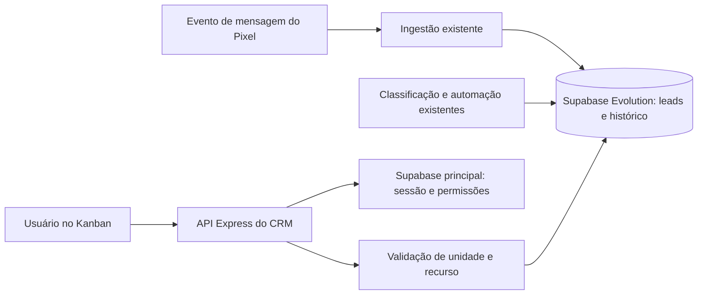

# Planejamento do CRM Kanban integrado ao Pixel

Data: 29/09/2026. Entrega: especificação funcional e técnica; implementação e deploy não realizados.

## 1. Objetivo e decisões propostas

Disponibilizar um CRM na dashboard para acompanhar os leads captados pelo Pixel, organizados em colunas de status. Cada cartão apresenta nome, instância de origem, temperatura atual e telefone. O acesso depende da sessão Supabase, da permissão do Pixel e da unidade autorizada.

O CRM será uma nova apresentação dos mesmos leads do Pixel. Não haverá cópia de contatos para uma segunda tabela de leads nem sincronização entre dois cadastros independentes.

Premissas adotadas para tornar o plano executável:

- “Número do lead” significa telefone/WhatsApp. O UUID continua sendo o identificador interno.
- Uma página `/dashboard/crm`, com entrada “CRM” junto ao Pixel e atalho entre as duas páginas.
- Um quadro por unidade selecionada, reunindo as instâncias daquela unidade.
- Sete etapas fixas na primeira entrega, aproveitando os códigos existentes.
- Usuários com acesso ao Pixel podem consultar e movimentar leads de suas unidades. Administradores mantêm o acesso ao Pixel previsto na política atual, mas também precisam de sessão Supabase válida.
- Temperatura vem da classificação já utilizada pelo Pixel; não será recalculada no navegador nem editada manualmente no MVP.
- Movimentação manual coloca a etapa em modo manual até o usuário retomar a automação. A temperatura continua sendo atualizada automaticamente.

As premissas são propostas de produto, não funcionalidades já implementadas. Colunas personalizadas, papéis comerciais próprios, cadastro manual, múltiplas oportunidades por contato, tarefas, disparos de WhatsApp e exportação ficam para evoluções posteriores.

## 2. O que já existe e o que precisa mudar

Análise feita no repositório local. O grafo orientou a descoberta; o código atual foi consultado porque algumas referências de linha do grafo estão desatualizadas. Não foi auditado o schema efetivamente aplicado nos ambientes remotos.

| Base existente | Evidência no repositório | Uso no CRM |
|---|---|---|
| Kanban administrativo, cartões, colunas e drag-and-drop | `client/src/pages/EvolutionAdmin.tsx`, componentes `CrmLeadCard` e `CrmStageColumn` | Extrair componentes de apresentação reutilizáveis |
| Etapas e resolução de movimento | `client/src/lib/crmPipeline.ts` | Centralizar contrato compartilhado com servidor |
| Leads com telefone, instância, etapa e temperatura | `server/evolutionSupabaseStore.ts`, tipo `EvolutionLead` | Fonte única de dados |
| Histórico e RPC de movimentação | Store: `moveEvolutionLeadCrmStageSupabase`, `listEvolutionCrmStageHistorySupabase` | Evoluir para escopo por unidade e controle de concorrência |
| CRM administrativo protegido por `requireSupabaseAdmin` | `server/routes/evolutionRoutes.ts` | Criar endpoints do Pixel; não abrir endpoints administrativos globais |
| Permissão `pixel_access` e política de acesso | `server/auth.ts`, `client/src/lib/pixelAccessPolicy.ts`, migration `add_pixel_access_permission` | Mesma elegibilidade para Pixel e CRM |
| Página e guarda de rota do Pixel | `DashboardPixel.tsx`, `PixelRoute.tsx`, `App.tsx`, `AppLayout.tsx` | Mesma navegação, unidade e linguagem visual |
| Instância vinculada a `unit_id` | `db/evolution_pixel_instance_binding.sql` | Isolamento por unidade |
| Exclusão de não leads e quarentena | `server/evolutionPixelPolicy.ts`, versão da RPC em `db/evolution_quarantine.sql` | Mesma visibilidade para lista, contagens, detalhe e alterações |
| Automação de etapa e temperatura com gravação em lote | `server/evolutionLeadStageBuffer.ts`, `db/evolution_lead_stage_batch.sql`, `db/evolution_lead_score.sql` | Compartilhar dados e proteger decisões manuais |

Lacunas relevantes:

1. O CRM atual é administrativo; não atende ao acesso dos usuários comuns do Pixel.
2. A leitura de leads por instância termina em 500 registros; a leitura administrativa termina em 200. Esses limites não podem definir o universo do novo quadro.
3. `requireAuth` revalida o usuário no Supabase apenas em produção. O CRM precisa dessa validação em qualquer ambiente em que esteja habilitado.
4. O store do Evolution usa um Supabase separado, com `service_role`. O JWT do Supabase principal não deve ser presumido válido nesse segundo projeto.
5. O bloqueio de movimentação durante a automação diária não resolve, sozinho, as propostas antigas acumuladas no buffer da automação ao vivo.
6. Existem versões sucessivas de `verify_lead_unit_access`; a versão com quarentena precisa prevalecer no ambiente de destino.

## 3. Experiência do Kanban

### Colunas

| Ordem | Rótulo proposto | Código atual | Significado operacional |
|---|---|---|---|
| 1 | Não respondido | `lead_not_responded` | Lead ainda sem atendimento inicial |
| 2 | Atendimento iniciado | `lead_responded` | Equipe enviou a primeira resposta |
| 3 | Follow-up | `follow_up` | Contato aguardando acompanhamento |
| 4 | Lead respondeu | `lead_replied` | Lead retornou e a conversa pode avançar |
| 5 | Negociação | `negotiation` | Discussão comercial em andamento |
| 6 | Ganho | `closed_won` | Conversão confirmada |
| 7 | Perdido | `closed_lost` | Oportunidade encerrada sem conversão |

Os rótulos diferenciam quem respondeu, mantendo os códigos que já são usados pelo backend. A sequência organiza o quadro; não obriga o usuário a passar por todas as etapas. Leads novos sem etapa entram em Não respondido. Leads existentes preservam sua etapa.

### Cartão

```text
┌──────────────────────────────────┐
│ Maria Oliveira                   │
│ Instância: Atendimento Centro     │
│ Quente                           │
│ +55 (11) 99999-0000               │
│ Etapa manual · atualizado há 5 min│
└──────────────────────────────────┘
```

Nome como informação principal; nome amigável da instância, com `instanceName` como alternativa; temperatura com texto e cor; telefone legível e copiável. Os dados do exemplo são fictícios.

Temperaturas: `HOT` → Quente, `WARM` → Morno, `COLD` → Frio, `null` → Não avaliado. Não converter ausência de avaliação em Frio. Mostrar quando a temperatura foi calculada no detalhe.

Sem nome: “Contato sem nome”. Sem telefone: “Número indisponível”, ou somente o final disponível, identificado como parcial. Não fabricar telefone a partir de identificadores internos como JID do tipo LID.

### Interações e estados

- Arrastar entre colunas ou usar “Mover para…” por menu, teclado e toque. Arrastar dentro da mesma coluna não altera a etapa nem cria histórico.
- Ordenação padrão por entrada mais recente na etapa, com UUID como desempate. Reordenação manual dentro da coluna fica fora do MVP.
- Movimento otimista, indicador de salvamento por cartão e reversão em falha. Em conflito, atualizar o cartão com o estado do servidor e avisar o usuário.
- Ao reabrir Ganho ou Perdido, solicitar confirmação contextual e registrar a reabertura. Entrada em etapa final permanece como ação explícita do usuário ou da automação existente.
- Clique abre painel lateral com os quatro campos obrigatórios, etapa, origem, conversa, atribuição de anúncio quando disponível e histórico de mudanças.
- Histórico informa origem manual/automática, autor, data, etapa anterior, nova etapa e observação, se houver. Não expor e-mails internos desnecessários a usuários comuns.
- Filtros: instância, temperatura, etapa, classificação e busca por nome/telefone. Sem filtro de período por padrão, para não ocultar negociações antigas.
- Cabeçalho com unidade atual, total correspondente aos filtros, última atualização e botão Atualizar. Cada coluna informa total e quantidade carregada.
- Diferenciar ausência de instâncias, nenhum lead, nenhum resultado para filtros, carregamento, erro com tentativa novamente, sessão expirada e acesso revogado.
- Desktop com rolagem horizontal; celular com seletor de etapa e lista vertical. As sete etapas continuam acessíveis.
- Troca de unidade limpa cartões, painel e cursores imediatamente, cancela requisições antigas e impede que respostas atrasadas exibam dados da unidade anterior.

## 4. Integração e regras de negócio



O cartão usa o mesmo `evolution_leads.id` mostrado no Pixel. A chave de contato existente é `(instance_name, contact_key)`: mensagens repetidas não criam cartões novos; o mesmo telefone em instâncias diferentes continua sendo contatos distintos. Unificação global por telefone não faz parte da entrega.

Visibilidade canônica: lead vinculado a uma instância da unidade autorizada, `classification != 'nao_lead'` e `is_quarantine = false`. Leads pendentes que já são visíveis no Pixel também aparecem no CRM, com identificação de pendência no detalhe. Confirmar, descartar ou promover da quarentena deve refletir em ambas as telas.

Etapa comercial (`crm_stage`), validade do contato (`classification`) e temperatura (`temperature`) são conceitos separados. “Perdido” continua sendo um lead visível; “Não lead” deixa de aparecer. Mover para Ganho não altera automaticamente a temperatura.

O novo CRM escreve apenas a etapa comercial e seu controle de automação. O campo legado `funnel_stage` permanece sem alteração nesta entrega. Antes da liberação, identificar relatórios que o utilizam e rotular métricas do CRM com base em `crm_stage`, evitando duas interpretações de “Ganho”.

Desconectar uma instância não exclui cartões. Instâncias sem unidade ficam fora dos quadros comuns até sua vinculação administrativa. Transferir uma instância entre unidades muda o acesso aos contatos associados: a transação de movimentação deve conferir o vínculo vigente para não operar com uma autorização antiga.

Não haverá envio de eventos de conversão para Meta/Google por mover um cartão. Integrações de conversão exigem um escopo próprio; aqui a integração é com os dados do Pixel da plataforma.

## 5. Modelo de dados e concorrência

Reutilizar `evolution_leads`, `evolution_instances` e `evolution_crm_stage_history`. Não criar tabela de cartões: o cartão é uma projeção do lead.

| Alteração proposta | Finalidade |
|---|---|
| `evolution_leads.crm_version bigint not null default 0` | Versão monotônica para conflitos de etapa e modo de automação |
| `evolution_leads.crm_stage_mode text not null default 'automatic'` | Valores permitidos: `automatic`, `manual` |
| Histórico: `actor_id text`, `actor_type text`, `request_id uuid`, `version_after bigint` | Autoria estável, origem e rastreabilidade; sem FK para outro projeto Supabase |
| Histórico: `event_type`, modo anterior e modo novo, quando aplicáveis | Registrar também a retomada da automação, mesmo sem mudança de etapa |
| Recibos de mutação com unicidade `(actor_id, request_id)` | Repetição segura de requisições, incluindo operações sem mudança de etapa |

Manter `changed_by` para compatibilidade com leitores antigos. O ator novo vem do servidor; nunca do corpo enviado pelo navegador. Os identificadores entre Supabase principal e Evolution são referências lógicas, não relacionamentos SQL entre projetos.

Movimento deve ser uma única transação/RPC versionada: localizar lead e instância, bloquear linhas em ordem consistente, verificar unidade atual e visibilidade, comparar versão, alterar etapa/modo, incrementar versão e gravar histórico/recibo. As operações de transferência de instância devem respeitar os mesmos locks. Não separar UPDATE e INSERT do histórico em chamadas HTTP independentes.

O endpoint aceita `expectedVersion`. Se estiver defasada, responde `409 VERSION_CONFLICT`. Repetir `requestId` com o mesmo ator e payload devolve o resultado anterior; reutilizar com payload diferente retorna conflito. O escopo e a autorização são revalidados antes de devolver qualquer recibo. Proposta de retenção: recibos por 7 dias; fora da janela, o controle de versão ainda impede reaplicar a mutação antiga.

Um movimento manual ativa `crm_stage_mode = 'manual'`. “Retomar automação” é ação explícita, versionada e auditada; solicita uma classificação nova. Propostas automáticas carregam a versão que observaram e só podem gravar se ela ainda coincidir e o modo continuar automático. Todas as fontes de alteração — tela administrativa, automação diária, automação ao vivo e RPC em lote — precisam respeitar a mesma regra. Uma proposta descartada por conflito deve ser registrada como ignorada, sem derrubar outras entradas do lote.

A temperatura usa o mecanismo existente, mas sua atualização deve rejeitar avaliações de mensagens mais antigas que a última fonte aplicada. Adicionar versão da fonte de classificação, preferencialmente uma sequência monotônica de mensagens, se o mecanismo atual não fornecer uma. `lead_score_updated_at` mostra persistência, não substitui a versão da mensagem analisada.

Índices candidatos, a validar com EXPLAIN e volume representativo: instância por `unit_id`; leads por `(instance_name, crm_stage, crm_stage_updated_at desc, id desc)` com predicado de visibilidade; histórico por `(lead_id, changed_at desc, id desc)`. Tratar nulos de data por backfill para `first_contact_at`. Busca por telefone normalizado e nome deve acontecer no servidor; avaliar índice específico conforme o plano de consulta.

## 6. Autenticação e autorização

Fluxo obrigatório em cada endpoint do CRM:

1. Validar a sessão do Supabase principal no servidor com `auth.getUser(accessToken)`; ausência, token inválido ou expirado resultam em `401`. Fazer isso também fora de produção quando a funcionalidade estiver habilitada.
2. Se o JWT próprio da plataforma estiver presente no fluxo existente, exigir que a identidade coincida com a do Supabase. O JWT próprio isolado não libera CRM.
3. Consultar perfil atual: ativo e com acesso ao Pixel conforme a política vigente. Não decidir a autorização por `localStorage`, `user_metadata` ou flag antiga do JWT.
4. Resolver a unidade pelo catálogo autorizado e normalizar os aliases existentes. Permissão de Pixel não significa acesso a todas as unidades.
5. Validar o lead, instância, histórico e conversa contra a unidade efetiva. Repetir a verificação de vínculo na transação que altera dados.

Criar um contexto de autorização compartilhado, evitando revalidar o mesmo usuário várias vezes na mesma requisição. Evoluir `requireAuth` ou compor um middleware específico que garanta a validação Supabase em todos os ambientes. `requirePixelAccess` e `resolvePixelUnit` continuam referências, mas devem consumir identidade e permissões recém-validadas.

Política de respostas: `401` para sessão inválida, `403` para falta de acesso ao Pixel/unidade, `404` para lead inexistente, invisível ou fora do escopo de uma unidade autorizada, `409` para conflito, `422` para payload semanticamente inválido, `429` para limite e `503` para dependência indisponível. Não transformar indisponibilidade do Supabase em permissão concedida.

Manter cookies HttpOnly/Secure e proteção CSRF/origem nas mutações, seguindo a configuração de proxy confiável da aplicação. Retornar `Cache-Control: no-store` para dados de CRM. Oculte o menu e proteja a rota na interface, mas a API é a fronteira de autorização.

### Dois projetos Supabase

Preservar o desenho existente: Auth/perfis/unidades no principal; dados do Pixel no Evolution. O navegador acessa a API da plataforma, e somente o backend acessa o Evolution com credencial de serviço.

No Evolution, manter RLS habilitada em tabelas expostas, revogar acesso direto de `anon`/`authenticated` às tabelas e RPCs internas e conceder somente o necessário a `service_role`. A credencial de serviço ignora RLS: portanto, o isolamento por unidade é obrigatório na API e nas consultas/RPCs. Não usar `auth.uid()` do principal como se fosse automaticamente reconhecido no Evolution. Realtime direto do navegador não entra no MVP por essa fronteira de identidade.

Auditar grants dos overloads antigos das funções, views e rotas de detalhe reutilizadas. Nenhuma rota administrativa global deve ganhar acesso comum apenas pela troca de middleware.

A validação remota por `getUser` segue a [documentação oficial](https://supabase.com/docs/reference/javascript/auth-getuser). A combinação de grants e RLS, incluindo o bypass da chave de serviço, segue a [documentação de RLS](https://supabase.com/docs/guides/database/postgres/row-level-security).

## 7. Contratos da API

Prefixo proposto: `/api/evolution/pixel/crm`. Todos os endpoints exigem o fluxo de autenticação e autorização acima.

| Método e rota | Uso |
|---|---|
| `GET /board?unitId=...` | Metadados de etapas, instâncias autorizadas, contagens e primeira página de cada coluna |
| `GET /leads?unitId=...&stage=...&cursor=...&limit=...` | Próxima página de uma coluna |
| `GET /leads/:id?unitId=...` | Detalhe do cartão |
| `PATCH /leads/:id/stage` | Movimento versionado |
| `PATCH /leads/:id/automation` | Retomar automação da etapa com controle de versão |
| `GET /leads/:id/history?unitId=...&cursor=...` | Histórico paginado |

Reutilizar `/api/evolution/pixel/leads/:id/messages` e `/attribution` para o painel, após garantir a mesma validação Supabase e o mesmo escopo. Classificação manual continua no endpoint do Pixel já existente, sujeito ao mesmo controle de acesso.

Filtros comuns a board e lista: `instanceName`, `temperature` (`HOT`, `WARM`, `COLD`, `unrated`), `classification`, `q` e etapa opcional no board. Consultas precisam limitar tamanho e validar enums. `unitId` é obrigatório; nunca inferir acesso global na sua ausência. `instanceName` precisa pertencer à unidade validada.

Página inicial: até 25 cartões por coluna. Limite máximo sugerido: 100 por chamada de lista. Retornar `items`, `total`, `nextCursor` e `hasMore` por coluna; totais devem refletir o banco com os mesmos filtros, não o número de cartões carregados. Board deve obter contagens e primeiras páginas de forma consistente, idealmente em uma RPC de leitura com snapshot único.

Cursor opaco e validado, associado à unidade, etapa e filtros, ordenado por `(crm_stage_updated_at desc, id desc)`. Contadores e cartões são um retrato do instante consultado. Durante paginação com alterações concorrentes, deduplicar por ID e reiniciar páginas afetadas após refetch, sem prometer snapshot permanente entre chamadas.

Payload de movimento:

```json
{
  "unitId": "unidade-autorizada",
  "stage": "negotiation",
  "expectedVersion": 12,
  "requestId": "2f57273b-8318-47a8-9a3a-5e85e3e1f7b1",
  "note": "Cliente pediu proposta."
}
```

`note` opcional, até 500 caracteres. O servidor descobre a instância pelo lead. Rejeitar campos desconhecidos, incluindo autor e chaves de escopo que tentem substituir a instância. Resposta `200`: cartão atualizado com `crmStage`, `crmVersion`, `crmStageMode` e timestamps. Erros usam `{ "error": { "code": "VERSION_CONFLICT", "message": "Este lead foi atualizado. Recarregue o cartão." } }` e um identificador de requisição.

Retomar automação recebe `unitId`, `expectedVersion`, `requestId` e `mode: "automatic"`. O retorno confirma a mudança de modo; a classificação assíncrona posterior aparece no próximo refresh. Não reutilizar propostas anteriores à retomada.

## 8. Atualização e desempenho

Primeira versão: busca inicial, atualização após mutações, ao recuperar foco e polling a cada 20 segundos enquanto a página estiver visível. Cadência é uma proposta ajustável após medir carga. Suspender polling em aba oculta; aplicar backoff em erros e impedir requisições sobrepostas.

Consultar somente páginas visíveis e contagens; não recarregar conversas e atribuições a cada polling. Detalhes são carregados ao abrir o cartão. Ao detectar mudanças, preservar rolagem quando possível e invalidar as colunas afetadas. Exibir horário de atualização; temperatura reflete a última classificação persistida pelo Pixel, cuja latência também depende do flush existente.

Não vincular o novo Kanban ao endpoint de overview que também resolve anúncios e criativos. Ele precisa de uma consulta própria, leve e paginada. Usar abort de requisições, cache em memória segmentado por usuário/unidade/filtros e limpeza imediata em logout, `401` ou `403`.

Metas propostas para homologação: API de board p95 abaixo de 1 segundo com 10 mil leads por unidade em ambiente representativo; nenhuma consulta proporcional ao total de leads na memória do Node; ausência de duplicação no cliente após refresh. Essas são metas a medir, não resultados já alcançados.

## 9. Plano de implementação

| Fase | Entregas | Condição de conclusão |
|---|---|---|
| 1. Contratos e diagnóstico | Tipos compartilhados, critérios de visibilidade, inventário de writers de etapa, inspeção dos schemas/grants reais | Todas as fontes de alteração mapeadas e divergências registradas |
| 2. Persistência | Migração aditiva, versão/modo, auditoria, recibos, índices e RPC transacional | Movimento atômico, concorrência e isolamento testados no banco |
| 3. Autenticação e API | Contexto Supabase, autorização por unidade, endpoints paginados e validação de payload | Matriz de acesso e contratos passando |
| 4. Integração com automações | Atualizar writes administrativos, diários e ao vivo; impedir propostas antigas | Movimento manual preservado em todas as fontes |
| 5. Interface | Página CRM, navegação, componentes extraídos, cartões, filtros, detalhe e mobile | Fluxo completo com estados de erro e acessibilidade |
| 6. Homologação e liberação | Testes integrados, carga, revisão de grants e ativação gradual | Critérios de aceite satisfeitos e métricas estáveis |

Estimativa orientativa para uma pessoa familiarizada com o projeto: 10–15 dias úteis, incluindo integração e homologação. Revisar após inspecionar os bancos reais; não representa prazo fechado. A fase 5 pode começar com respostas simuladas após estabilizar os contratos, mas a liberação depende das fases 2–4.

Arquivos propostos: `shared/crm.ts`; `server/routes/pixelCrmRoutes.ts`; `server/pixelCrmService.ts`; `client/src/pages/DashboardCrm.tsx`; `client/src/components/crm/{CrmBoard,CrmColumn,CrmLeadCard,CrmLeadDrawer,CrmFilters}.tsx`; `client/src/hooks/usePixelCrm.ts`.

Arquivos existentes a integrar: `server/auth.ts`, `server/routes/evolutionRoutes.ts`, `server/evolutionSupabaseStore.ts`, writers de automação e buffer, `client/src/App.tsx`, `AppLayout.tsx`, `PixelRoute.tsx`, `EvolutionAdmin.tsx` e `client/src/lib/crmPipeline.ts`. As migrations devem ser geradas para o projeto de destino correto; mudanças no Evolution não podem ser aplicadas por engano no Supabase principal.

## 10. Testes e critérios de aceite

| Cenário | Resultado esperado |
|---|---|
| Sem sessão Supabase ou apenas JWT próprio | `401` em todas as rotas CRM, inclusive desenvolvimento |
| Usuário ativo sem Pixel | Menu ausente; navegação bloqueada; API `403` |
| Usuário com Pixel e unidade autorizada | Acesso a board, detalhe, histórico e movimento |
| Unidade não autorizada ou instância adulterada | Nenhum dado retornado nem alteração efetuada |
| UUID de outra unidade em rota autorizada | `404`, inclusive mensagens/histórico/atribuição |
| Revogação de Pixel, unidade ou desativação do perfil | Próxima requisição bloqueada e interface limpa |
| Administrador sem sessão válida | `401`; role não substitui autenticação |
| Requisição direta ao Evolution com anon/authenticated | Tabelas e RPCs internas indisponíveis |
| Contato em quarentena ou não lead | Ausente de lista, contagem, detalhe e mutação |
| Promoção da quarentena | Mesmo ID passa a aparecer; sem duplicação |
| Evento duplicado do Pixel | Um único contato/cartão por chave existente |
| Mais de 500 leads | Todos acessíveis por paginação; total correto |
| Temperatura nula ou telefone ausente | Alternativas explícitas, sem valor inventado |
| Movimento concluído | Nova coluna, persistência após reload e um evento de histórico |
| Mesmo requestId repetido | Resultado idempotente; sem histórico duplicado |
| Dois usuários movem a mesma versão | Um sucesso e um conflito; sem perda silenciosa |
| Automação antiga após mudança manual | Etapa preservada e proposta descartada |
| Retomada de automação | Modo atualizado, evento auditado e classificação nova |
| Transferência de instância durante mutação | Vínculo revalidado de forma atômica; sem escrita fora de escopo |
| Falha na gravação do histórico | Transação inteira revertida |
| Falha de rede ou Supabase | Mensagem útil, estado reconciliado e sem acesso permissivo |
| Troca rápida de unidade | Nenhuma resposta antiga aparece no quadro novo |
| Teclado, toque e mobile | Possível consultar e mover sem depender de drag-and-drop |

Testes unitários para políticas/validação; integração HTTP para autenticação e escopo; testes reais de transação/grants em ambiente isolado; testes de interface para movimento, filtros e estados. Executar `pnpm check`, testes relevantes com Vitest e `pnpm build` na implementação. Não executar testes de integração que gravem dados de produção.

## 11. Liberação, observabilidade e reversão

Usar flag de funcionalidade independente da permissão: a flag controla o rollout; a autorização continua sendo a do Pixel. Primeiro liberar para uma unidade piloto, depois para as demais elegíveis.

Antes de habilitar: conferir schema e grants remotos; preservar etapas atuais; preencher versão/modo e datas faltantes sem reclassificar contatos; atualizar todos os writers; validar contas com e sem acesso e testar uma unidade com mais de 500 leads. Tipos ou etapas legadas inválidas devem ser contabilizados para correção, não silenciosamente apagados.

Registrar latência, erros por código, movimentos, conflitos, propostas automáticas descartadas, atrasos de classificação e falhas do buffer. Logs operacionais usam IDs e requestId; não armazenam tokens, telefones completos ou conteúdo de conversas. Histórico comercial segue a política de retenção da plataforma, a definir antes de expansão do escopo.

Reversão: desligar a flag e parar a exposição das rotas novas; preservar migração aditiva e histórico. Se for preciso voltar uma versão que não respeita o modo manual/controle de versão, pausar os writers automáticos e mutações antigas antes. Não deixar um backend legado sobrescrever decisões protegidas pela versão nova.

## 12. Limites e pontos para a implementação

Este planejamento cobre os requisitos solicitados e adota decisões explícitas para os detalhes em aberto. As decisões de produto que podem ser revistas são os rótulos das sete etapas, edição por todos os usuários com Pixel e o modo manual persistente até retomada da automação.

A implementação começa validando o schema efetivo dos dois projetos, os grants e os consumidores de `funnel_stage`. A análise local não comprova que todas as migrations já estejam aplicadas em produção, nem mede a escala e a latência reais. Não há necessidade de criar outro Supabase, duplicar autenticação ou instalar uma biblioteca de Kanban: `@dnd-kit` já está nas dependências.
